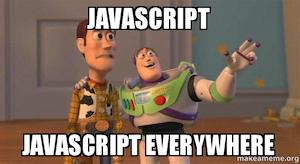

1. [전역변수는 왜 나쁠까?](pages/01.md)
2. [자바스크립트 Scope 이해하기](pages/02.md)
3. [var 대신 let만 쓰라구요? 왜요?](pages/03.md)
4. [클로저가 도대체 뭘까?](pages/04.md)
5. [동일 연산자 제대로 쓰기](pages/05.md)
6. [함수를 정의하는 두가지 방법](pages/06.md)
7. [delete, 언제 쓰는게 좋을까?](pages/07.md)
8. [String, 헤쳐모여!](pages/08.md)
9. [두 날짜가 며칠 차이?](pages/09.md)
10. [보기 좋은 Backtick 쓰기도 좋다.](pages/10.md)
11. [Default Parameter](pages/11.md)
12. [JS 주소값 활용법](pages/12.md)
13. [원시타입과 참조타입](pages/13.md)
14. [조건문 너 멈춰!](pages/14.md)
15. [생성자 이해하기](pages/15.md)
16. [호이! 호이스팅이란?](pages/16.md)
17. [잠시만요! 형 바꾸고 가실께요~](pages/17.md)
18. [Define the "undefined"](pages/18.md)
19. [아직도 for만 쓰니?](pages/19.md)
20. [잡았다 요돔(DOM)!](pages/20.md)
21. [이벤트 전달 : 너가 왜 동작해?](pages/21.md)
22. [includes() : String탐색](pages/22.md)
23. [Prototype : 너의 원형은..?!](pages/23.md)
24. [Prototype 선언 방법, 뉴크셋](pages/24.md)
25. [오랜만이야 Closure](pages/25.md)
26. [for in loop로 객체 들여다보기](pages/26.md)
27. [Make it! 다차원 배열](pages/27.md)
28. [☆뽀나쓰☆ Tip of Console](pages/28.md)
29. [객체.. 또 객체?](pages/29.md)
30. [상속者들](pages/30.md)
31. [치료가 필요한 정도로 심각한 'try-catch' 중독증입니다.](pages/31.md)
32. [Let's switch](pages/32.md)
33. [새로운반복문 repeatADay()🤞](pages/33.md)
34. [객체의 늪, 함수도 객체](pages/34.md)
